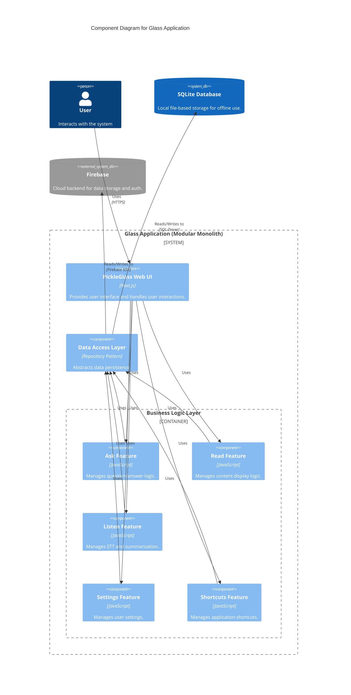

# 🏗️ System Architecture

[← Back to Index](./index.md)

---

## Overview

The system is a Layered, Modular Monolith, primarily built as a Next.js web application. It is organized into distinct feature-based modules (e.g., 'ask', 'read', 'listen'), each with its own business logic and a dedicated data access layer. A key architectural feature is its pluggable persistence mechanism, utilizing the Repository pattern to abstract data storage and support both Firebase (cloud) and SQLite (local) backends. This design promotes a strong separation of concerns, enhances testability, and allows the application to operate in different environments (online/offline).

## Architectural Style

**Style**: Modular Monolith

## System Layers

1. Presentation
2. Business Logic
3. Data Access
4. Infrastructure

## Main Components

### PickleGlass Web UI

**Type**: module

The primary user-facing component, acting as the Presentation Layer. It is a web application built using the Next.js framework.

**Responsibilities**:
- Rendering user interfaces and pages
- Handling user input and interactions
- Client-side state management
- Invoking business logic from the feature modules

**Dependencies**: Ask Feature Module, Read Feature Module, Listen Feature Module, Settings Feature Module, Shortcuts Feature Module

**Technologies**: Next.js, React, TypeScript, HTML/CSS, Tailwind CSS

### Feature Modules (Core Business Logic)

**Type**: layer

A collection of vertical slices representing the core business capabilities of the application. Each feature is encapsulated in its own module.

**Responsibilities**:
- Implementing the specific business rules for each feature
- Orchestrating data flow between the presentation and data access layers
- Defining the application's core use cases

**Dependencies**: Data Access Layer (Repositories)

**Technologies**: JavaScript, TypeScript

### Ask Feature Module

**Type**: module

Handles functionality related to asking questions or querying information.

**Responsibilities**:
- Processing user queries
- Retrieving answers or relevant data
- Managing the state of 'ask' operations

**Dependencies**: Data Access Layer (Repositories)

**Technologies**: JavaScript

### Read Feature Module

**Type**: module

Manages features related to reading or displaying content.

**Responsibilities**:
- Fetching content for display
- Formatting text
- Managing reading progress or state

**Dependencies**: Data Access Layer (Repositories)

**Technologies**: JavaScript

### Listen Feature Module

**Type**: module

A composite module for audio-related functionalities, including Speech-to-Text (STT) and summarization.

**Responsibilities**:
- Capturing audio input
- Coordinating with the STT sub-module to transcribe speech
- Coordinating with the Summary sub-module to generate text summaries

**Dependencies**: STT Sub-module, Summary Sub-module, Data Access Layer (Repositories)

**Technologies**: JavaScript

### Data Access Layer (Repositories)

**Type**: layer

An abstraction layer responsible for data persistence. It implements the Repository pattern, with concrete implementations for different database systems.

**Responsibilities**:
- Abstracting data storage and retrieval operations (CRUD)
- Providing a consistent data access API to the business logic layer
- Decoupling business logic from specific database technologies

**Dependencies**: Firebase, SQLite

**Technologies**: JavaScript, Firebase SDK, SQLite Driver

### Firebase

**Type**: service

An external, cloud-based backend service used for data storage, authentication, and other backend functionalities.

**Responsibilities**:
- Providing a cloud-hosted NoSQL database (Firestore or Realtime Database)
- User authentication and management
- Potentially hosting serverless functions

**Technologies**: Firebase

### SQLite

**Type**: service

An embedded, file-based SQL database engine used for local data storage.

**Responsibilities**:
- Providing a local, persistent data store
- Enabling offline functionality
- Storing user data directly on the client device

**Technologies**: SQLite

## External Integrations

- User Interface (Web)
- Database (Firebase via SDK/API)
- Database (SQLite via local driver)
- Potential External AI/ML APIs (for STT and Summarization)

## Architecture Diagram

> 💡 **Tip**: View this diagram with a Mermaid renderer:
> - VS Code: Install "Markdown Preview Mermaid Support" extension
> - GitHub/GitLab: Automatic rendering in markdown preview
> - Online: Copy to [mermaid.live](https://mermaid.live)

📊 Click to view component diagram

## 💡 Key Insights

1. [object Object]
2. [object Object]
3. [object Object]
4. [object Object]
5. [object Object]

## 💡 Recommendations

Based on the architectural analysis, consider the following improvements:

- **Address**: [object Object]
- **Address**: [object Object]
- **Address**: [object Object]
- **Address**: [object Object]

## Architecture Metadata

| Property | Value |
|----------|-------|
| **Architecture Style** | Modular Monolith |
| **Layers** | Presentation, Business Logic, Data Access, Infrastructure |
| **Total Components** | 8 |
| **External Integrations** | User Interface (Web), Database (Firebase via SDK/API), Database (SQLite via local driver), Potential External AI/ML APIs (for STT and Summarization) |
| **Analysis Date** | 2025-11-30 |

---

_Architecture analysis completed on 2025-11-30T20:45:40.026Z_

---

[← Back to Index](./index.md) | [Next: File Structure →](./file-structure.md)
