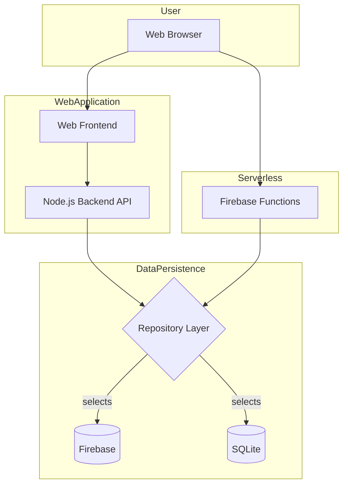
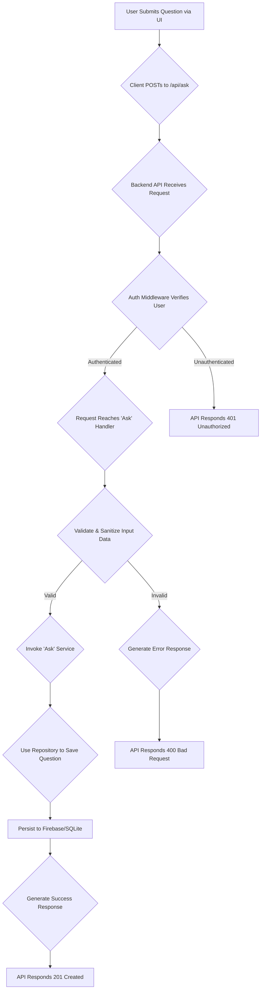

# Flow Visualizations

The system is a distributed application composed of a 'pickleglass_web' component (likely a Node.js/Express backend with a frontend) and a serverless part using Firebase Functions. It employs a robust Repository pattern for data access, allowing it to switch between Firebase and SQLite. Authentication is managed in the Node.js backend using a standard JWT-based middleware approach, securing API endpoints.

## Identified Flows

### High-Level System Architecture

**Type**: component-flow

This diagram illustrates the interaction between the major architectural components: the end-user's client, the web application (frontend and Node.js backend), serverless functions, and the abstracted database layer.

#### Diagram

> 💡 **Tip**: View this diagram with a Mermaid renderer:
> - VS Code: Install "Markdown Preview Mermaid Support" extension
> - GitHub/GitLab: Automatic rendering in markdown preview
> - Online: Copy to [mermaid.live](https://mermaid.live)

<details>
<summary>📊 Click to view component-flow diagram</summary>



</details>

#### Key Insights

- The architecture is decoupled, separating the web server, serverless functions, and data layer.
- The presence of both a Node.js backend and Firebase Functions suggests a hybrid approach, possibly using functions for event-driven tasks or specific, scalable endpoints.
- The Repository Layer is a critical abstraction point, enabling database flexibility and easier testing.

### Data Persistence via Repository Pattern

**Type**: data-flow

This flow shows how application data, such as from the 'ask' feature, is persisted. The application logic interacts with a generic repository interface, which then delegates the actual database operation to a concrete implementation (Firebase or SQLite).

#### Diagram

> 💡 **Tip**: View this diagram with a Mermaid renderer:
> - VS Code: Install "Markdown Preview Mermaid Support" extension
> - GitHub/GitLab: Automatic rendering in markdown preview
> - Online: Copy to [mermaid.live](https://mermaid.live)

<details>
<summary>📊 Click to view data-flow diagram</summary>

```mermaid
graph TD
    A[User Action e.g., 'Ask Question'] --> B{Application Service Logic}
    B --> C{Repository Interface (.save())}
    C --> D[FirebaseRepository]
    C --> E[SQLiteRepository]
    D --> F[(Firebase Database)]
    E --> G[(SQLite Database)]
    F --> H{Data Persisted}
    G --> H
```

</details>

#### Key Insights

- This pattern decouples business logic from the data storage technology.
- It allows the system to be configured for different environments, such as using SQLite for local development/testing and Firebase for production.
- Adding support for a new database would only require creating a new repository implementation, with minimal changes to the core application logic.

### User Login and JWT Issuance

**Type**: authentication-flow

This sequence diagram details the user login process. The client sends credentials to a dedicated authentication route, the backend validates them, and upon success, generates and returns a JSON Web Token (JWT) for the client to use in subsequent authenticated requests.

#### Diagram

> 💡 **Tip**: View this diagram with a Mermaid renderer:
> - VS Code: Install "Markdown Preview Mermaid Support" extension
> - GitHub/GitLab: Automatic rendering in markdown preview
> - Online: Copy to [mermaid.live](https://mermaid.live)

<details>
<summary>📊 Click to view authentication-flow diagram</summary>

```mermaid
sequenceDiagram
    participant Client
    participant Backend as Node.js Backend
    participant AuthRoute as /routes/auth.js
    participant JWTService

    Client->>+Backend: POST /api/auth/login (credentials)
    Backend->>+AuthRoute: Handle login request
    AuthRoute->>AuthRoute: Validate credentials against DB
    alt Credentials are valid
        AuthRoute->>+JWTService: Generate token for user
        JWTService-->>-AuthRoute: Returns JWT
        AuthRoute-->>-Backend: Respond with token
        Backend-->>-Client: 200 OK { token: '...' }
        Client->>Client: Store JWT securely
    else Credentials are invalid
        AuthRoute-->>-Backend: Respond with error
        Backend-->>-Client: 401 Unauthorized
    end
```

</details>

#### Key Insights

- The system uses stateless authentication with JWTs, which is scalable and common in modern web applications.
- The client is responsible for storing the token and including it in future API calls.
- The separation of concerns is clear: a dedicated route handles authentication logic, and a service handles token creation.

### Protected API Request

**Type**: api-flow

This diagram shows the lifecycle of a request to a protected API endpoint. It highlights the role of the authentication middleware, which acts as a gatekeeper, verifying the JWT before allowing the request to proceed to the main route handler.

#### Diagram

> 💡 **Tip**: View this diagram with a Mermaid renderer:
> - VS Code: Install "Markdown Preview Mermaid Support" extension
> - GitHub/GitLab: Automatic rendering in markdown preview
> - Online: Copy to [mermaid.live](https://mermaid.live)

<details>
<summary>📊 Click to view api-flow diagram</summary>

```mermaid
sequenceDiagram
    participant Client
    participant Server as Node.js Server
    participant AuthMiddleware as middleware/auth.js
    participant RouteHandler as Protected Route

    Client->>+Server: GET /api/data (Authorization: Bearer <JWT>)
    Server->>+AuthMiddleware: Execute middleware first
    AuthMiddleware->>AuthMiddleware: Extract and verify JWT
    alt Token is valid
        AuthMiddleware->>+RouteHandler: next()
        RouteHandler->>RouteHandler: Process request (e.g., fetch data)
        RouteHandler-->>-Server: Return response data
        Server-->>-Client: 200 OK { data: '...' }
    else Token is invalid or missing
        AuthMiddleware-->>-Server: Send 401/403 Error
        Server-->>-Client: 401 Unauthorized
    end
```

</details>

#### Key Insights

- Middleware is a core part of the application's security and request processing pipeline.
- This pattern centralizes authentication logic, avoiding code duplication in every protected route.
- The flow is terminated early if authentication fails, preventing unauthorized access to business logic and data.

### End-to-End 'Ask Question' Workflow

**Type**: process-flow

This flowchart outlines the business logic for a user submitting a question, from the initial API request to the final data persistence and response.

#### Diagram

> 💡 **Tip**: View this diagram with a Mermaid renderer:
> - VS Code: Install "Markdown Preview Mermaid Support" extension
> - GitHub/GitLab: Automatic rendering in markdown preview
> - Online: Copy to [mermaid.live](https://mermaid.live)

<details>
<summary>📊 Click to view process-flow diagram</summary>



</details>

#### Key Insights

- The process includes critical validation and security steps (authentication, data sanitization) before any business logic is executed.
- The flow clearly separates concerns: middleware for auth, handlers for routing, services for business logic, and repositories for data access.
- Error handling for different scenarios (unauthorized, invalid data) is an integral part of the process.

## Warnings

- ⚠️ This analysis is based on file structure, naming conventions, and a small sample of file paths. It infers common architectural patterns (e.g., Express.js, JWT) but cannot capture the specific implementation details or custom logic without a full source code review.
- ⚠️ The role of 'Firebase Functions' is inferred from the 'functions/index.js' file and may be more complex than depicted.
- ⚠️ The distinction between different features ('ask', 'read') is based on repository folder names and represents a likely, but not guaranteed, domain separation.


---

[← Back to Index](./index.md) | [← Previous: Patterns](./patterns.md) | [Next: Security Analysis →](./security.md)
